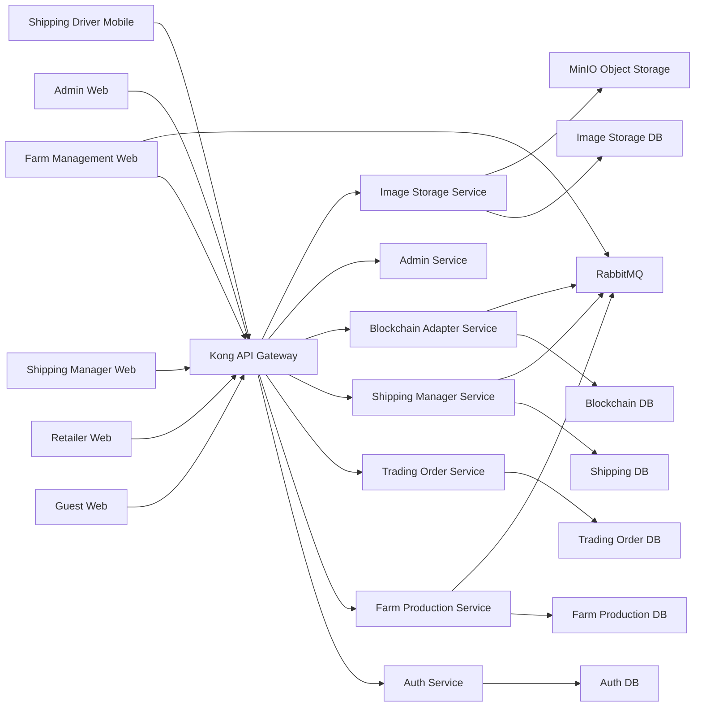

# Tài liệu SRS

## 1. Thông tin chung

- **Tên dự án:** BICAP - Blockchain Integration in Clean Agricultural Production
- **Tên tiếng Việt:** Tích hợp Blockchain trong sản xuất nông sản sạch
- **Phiên bản tài liệu:** 1.0
- **Ngày cập nhật:** 2026-05-23
- **Ngôn ngữ:** Tiếng Việt
- **Phạm vi tài liệu:** Đặc tả yêu cầu phần mềm cho hệ thống BICAP dựa trên đề bài gốc và hiện trạng source code trong repository.

## 2. Mục đích tài liệu

Tài liệu này mô tả đầy đủ các yêu cầu chức năng và phi chức năng của hệ thống BICAP. Mục tiêu là:

- Làm căn cứ thống nhất giữa nhóm phát triển, giảng viên hướng dẫn và người đánh giá đồ án.
- Mô tả rõ phạm vi nghiệp vụ, nhóm người dùng, quy trình chính, dữ liệu chính và các ràng buộc kỹ thuật.
- Tạo đầu vào cho các tài liệu tiếp theo như thiết kế kiến trúc, thiết kế chi tiết, kiểm thử, hướng dẫn cài đặt và hướng dẫn sử dụng.

## 3. Tài liệu tham chiếu

- `● TastRequirement.txt`
- `docker-compose.yml`
- `api-gateway/kong.yml`
- `BICAP_REVIEW.md`
- `clients/web-app/shipping-manager-web/README.md`
- `clients/web-app/farm-management-web/SETUP_COMPLETE.md`
- `clients/web-app/farm-management-web/NOTIFICATIONS_README.md`
- Các controller, route, màn hình và schema SQL hiện có trong repository.

## 4. Thuật ngữ và viết tắt

| Thuật ngữ | Ý nghĩa |
| --- | --- |
| BICAP | Blockchain Integration in Clean Agricultural Production |
| SRS | Software Requirements Specification |
| API | Application Programming Interface |
| JWT | JSON Web Token |
| QR Code | Mã QR dùng để truy xuất thông tin lô hàng hoặc lô xuất |
| FM | Farm Manager hoặc Farm Management |
| SSE | Server-Sent Events |
| MQ | Message Queue |
| Role Request | Yêu cầu cấp vai trò người dùng |

## 5. Tổng quan bài toán

Nhu cầu thị trường đối với nông sản sạch, minh bạch nguồn gốc và có khả năng truy xuất ngày càng tăng. Trong khi đó, các trang trại và hợp tác xã quy mô nhỏ hoặc vừa thường gặp khó khăn trong việc:

- Quản lý mùa vụ, lô sản xuất và nhật ký canh tác.
- Theo dõi chỉ số môi trường như nhiệt độ, độ ẩm, pH.
- Công bố thông tin minh bạch cho người tiêu dùng.
- Kết nối với nhà bán lẻ và đơn vị vận chuyển.
- Kiểm soát trạng thái giao nhận sau khi hàng rời trang trại.

Hệ thống BICAP được xây dựng để giải quyết bài toán này bằng cách kết hợp:

- Quản lý sản xuất nông nghiệp theo lô và theo mùa vụ.
- Đưa dữ liệu truy xuất lên lớp blockchain adapter.
- Sinh mã QR cho lô xuất để người dùng cuối hoặc nhà bán lẻ tra cứu.
- Kết nối trang trại, nhà bán lẻ, quản lý vận chuyển và tài xế giao hàng trên cùng một nền tảng.

## 6. Phạm vi hệ thống

### 6.1 Phạm vi nghiệp vụ

Hệ thống BICAP bao phủ các nhóm chức năng chính sau:

- Quản lý người dùng, xác thực và phân quyền.
- Quản lý hồ sơ trang trại và thông tin pháp lý.
- Quản lý mùa vụ, lô sản xuất, quy trình canh tác, chỉ số môi trường.
- Tạo lô xuất, sinh QR và truy xuất nguồn gốc.
- Đăng sản phẩm lên marketplace.
- Tạo và xử lý đơn đặt hàng giữa nhà bán lẻ và trang trại.
- Quản lý vận chuyển, tài xế, phương tiện và báo cáo giao hàng.
- Quản trị hệ thống, kiểm duyệt và thống kê.
- Thông báo thời gian thực và lưu trữ ảnh sản phẩm.

### 6.2 Phạm vi triển khai hiện có trong repository

Repository hiện thể hiện các thành phần sau:

- Web app cho `Admin`, `Farm Management`, `Retailer`, `Shipping Manager`, `Guest`.
- Mobile app cho `Shipping Driver` bằng Expo/React Native.
- Backend microservices cho `auth`, `farm-production`, `trading-order`, `shipping-manager`, `blockchain-adapter`, `admin-service`, `image-storage`.
- Hạ tầng `Kong Gateway`, `RabbitMQ`, `MySQL`, `MinIO`, `Docker Compose`.

### 6.3 Ghi chú hiện trạng quan trọng

- Lớp blockchain trong source code hiện được triển khai theo hướng **blockchain adapter mô phỏng**.
- `blockchain-adapter-service` đang tạo hash SHA-256, sinh `MOCK_TX_*` và trả kết quả verify giả lập thành công.
- Vì vậy, trong phạm vi hiện tại, hệ thống đạt mức **truy xuất và kiểm chứng logic nội bộ**, chưa phải tích hợp blockchain công khai thật sự.
- Repository có `delivery-service`, nhưng triển khai mặc định trong `docker-compose.yml` đang dùng `shipping-manager-service` làm dịch vụ vận chuyển chính. `delivery-service` được xem là thành phần phụ hoặc thử nghiệm, không phải baseline của bản triển khai hiện tại.

## 7. Mục tiêu hệ thống

- Minh bạch hóa quy trình sản xuất nông sản sạch.
- Tăng khả năng truy xuất nguồn gốc theo lô.
- Kết nối các tác nhân trong chuỗi cung ứng nông sản.
- Chuẩn hóa luồng từ sản xuất, niêm yết, đặt hàng, vận chuyển đến xác nhận giao hàng.
- Hỗ trợ giám sát và quản trị tập trung thông qua dashboard và báo cáo.

## 8. Mô tả tổng quan hệ thống

### 8.1 Nhóm người dùng

| Vai trò | Mô tả |
| --- | --- |
| Guest | Người dùng chưa đăng nhập hoặc người tiêu dùng muốn xem thông tin công khai, bài viết, marketplace và truy xuất nguồn gốc |
| Retailer | Nhà bán lẻ mua hàng từ trang trại, theo dõi đơn hàng và nhận hàng |
| Farm Manager | Chủ trang trại hoặc người quản lý trang trại |
| Shipping Manager | Người phụ trách điều phối đơn vận chuyển, tài xế và phương tiện |
| Shipping Driver | Tài xế giao nhận hàng, dùng mobile app để cập nhật trạng thái và báo cáo |
| Admin | Người quản trị hệ thống, quản lý người dùng, farms, sản phẩm, danh mục, role request và thống kê |

### 8.2 Bối cảnh vận hành

Hệ thống được triển khai dưới dạng nhiều client và nhiều backend service, liên thông qua API Gateway.

### 8.3 Các thành phần chính

| Thành phần | Công nghệ | Vai trò chính |
| --- | --- | --- |
| `auth-service` | Spring Boot | Đăng ký, đăng nhập, JWT, hồ sơ người dùng, giấy phép kinh doanh |
| `farm-production-service` | Spring Boot | Farms, lô sản xuất, quy trình canh tác, chỉ số môi trường, lô xuất, marketplace nội bộ |
| `trading-order-service` | Spring Boot | Marketplace phía giao dịch, đơn hàng, thanh toán, phản hồi |
| `shipping-manager-service` | Spring Boot | Vận đơn, tài xế, phương tiện, báo cáo, thông báo |
| `blockchain-adapter-service` | Spring Boot | Ghi hash dữ liệu, xác minh truy xuất, lưu transaction mock |
| `admin-service` | Spring Boot | Dashboard quản trị, users, farms, products, categories, orders, blockchain stats |
| `image-storage-service` | Spring Boot + MinIO | Upload và truy xuất ảnh sản phẩm |
| `admin-web` | Node.js + EJS | Giao diện quản trị |
| `farm-management-web` | Node.js + EJS + SSE | Giao diện quản lý trang trại và nhận thông báo realtime |
| `retailer-web` | Node.js + EJS | Giao diện nhà bán lẻ |
| `guest-web` | Node.js + EJS | Giao diện công khai cho khách |
| `shipping-manager-web` | React | Giao diện điều phối vận chuyển |
| `mobile-ship-driver` | Expo + React Native | Giao diện di động cho tài xế |

### 8.4 Giả định và phụ thuộc

- Hệ thống yêu cầu kết nối mạng ổn định giữa các client và các service.
- API gateway Kong là điểm vào chuẩn cho hầu hết request phía client.
- Các chức năng realtime phụ thuộc RabbitMQ hoạt động bình thường.
- Lưu trữ ảnh phụ thuộc MinIO và image-storage-service.
- Mobile app của tài xế cần quyền camera để quét QR và có thể cần quyền định vị cho các tính năng mở rộng.

## 9. Yêu cầu chức năng

### 9.1 Nhóm yêu cầu xác thực và tài khoản

| Mã | Yêu cầu |
| --- | --- |
| FR-AUTH-01 | Hệ thống phải cho phép người dùng đăng ký tài khoản với vai trò phù hợp. |
| FR-AUTH-02 | Hệ thống phải cho phép người dùng đăng nhập và nhận JWT để truy cập tài nguyên được phân quyền. |
| FR-AUTH-03 | Hệ thống phải hỗ trợ lưu và cập nhật hồ sơ cá nhân của người dùng. |
| FR-AUTH-04 | Hệ thống phải hỗ trợ cập nhật giấy phép kinh doanh hoặc thông tin pháp lý nếu vai trò yêu cầu. |
| FR-AUTH-05 | Hệ thống phải kiểm soát truy cập theo role như `ROLE_ADMIN`, `ROLE_FARMMANAGER`, `ROLE_RETAILER`, `ROLE_SHIPPINGMANAGER`, `ROLE_DELIVERYDRIVER`. |
| FR-AUTH-06 | Hệ thống phải hỗ trợ tiếp nhận và xử lý yêu cầu cấp vai trò thông qua `role request`. |

### 9.2 Nhóm yêu cầu cho Guest

| Mã | Yêu cầu |
| --- | --- |
| FR-GUEST-01 | Guest phải xem được trang chủ giới thiệu hệ thống và nội dung công khai. |
| FR-GUEST-02 | Guest phải tìm kiếm và xem danh sách sản phẩm trên marketplace công khai. |
| FR-GUEST-03 | Guest phải xem được chi tiết truy xuất nguồn gốc qua mã QR hoặc qua mã tra cứu. |
| FR-GUEST-04 | Guest phải xem được bài viết hoặc nội dung phổ biến kiến thức nông nghiệp sạch. |
| FR-GUEST-05 | Guest có thể đăng ký hoặc đăng nhập để chuyển sang vai trò được cấp quyền cao hơn. |

### 9.3 Nhóm yêu cầu cho Farm Manager

| Mã | Yêu cầu |
| --- | --- |
| FR-FARM-01 | Farm Manager phải tạo hoặc cập nhật hồ sơ trang trại. |
| FR-FARM-02 | Farm Manager phải xem thông tin farm theo chủ sở hữu hoặc theo mã farm. |
| FR-FARM-03 | Farm Manager phải tạo lô sản xuất cho từng farm. |
| FR-FARM-04 | Farm Manager phải xem danh sách lô sản xuất và thông tin chi tiết lô sản xuất. |
| FR-FARM-05 | Farm Manager phải thêm quy trình canh tác cho từng lô sản xuất. |
| FR-FARM-06 | Farm Manager phải ghi nhận và xem các chỉ số môi trường của lô sản xuất. |
| FR-FARM-07 | Hệ thống nên hỗ trợ đồng bộ hoặc lấy dữ liệu thời tiết cho lô sản xuất nếu cấu hình có sẵn. |
| FR-FARM-08 | Farm Manager phải tạo lô xuất từ lô sản xuất khi kết thúc mùa vụ hoặc khi cần xuất hàng. |
| FR-FARM-09 | Hệ thống phải sinh mã QR hoặc dữ liệu QR cho mỗi lô xuất. |
| FR-FARM-10 | Hệ thống phải ghi dữ liệu truy xuất của lô xuất sang blockchain adapter. |
| FR-FARM-11 | Farm Manager phải đăng sản phẩm hoặc lô hàng lên marketplace. |
| FR-FARM-12 | Farm Manager phải quản lý ảnh của sản phẩm marketplace. |
| FR-FARM-13 | Farm Manager phải xem đơn hàng đến từ Retailer theo farm. |
| FR-FARM-14 | Farm Manager phải xác nhận hoặc từ chối đơn hàng. |
| FR-FARM-15 | Farm Manager phải xem thông tin và trạng thái vận chuyển liên quan đến đơn hàng của mình. |
| FR-FARM-16 | Farm Manager phải nhận thông báo realtime liên quan tới đơn hàng, vận chuyển hoặc chỉ số cảnh báo. |
| FR-FARM-17 | Farm Manager phải gửi báo cáo cho quản trị khi phát sinh vấn đề nghiệp vụ hoặc kỹ thuật. |

### 9.4 Nhóm yêu cầu cho Retailer

| Mã | Yêu cầu |
| --- | --- |
| FR-RET-01 | Retailer phải đăng ký, đăng nhập và quản lý hồ sơ cá nhân. |
| FR-RET-02 | Retailer phải tìm kiếm và lọc sản phẩm trên marketplace. |
| FR-RET-03 | Retailer phải xem thông tin chi tiết sản phẩm, trang trại và lô hàng. |
| FR-RET-04 | Retailer phải tạo đơn đặt hàng từ marketplace product. |
| FR-RET-05 | Retailer phải xem danh sách đơn hàng của mình. |
| FR-RET-06 | Retailer phải xem chi tiết từng đơn hàng. |
| FR-RET-07 | Retailer phải theo dõi trạng thái đơn hàng qua các giai đoạn xác nhận, vận chuyển và hoàn tất. |
| FR-RET-08 | Hệ thống phải hỗ trợ thanh toán hoặc khởi tạo thanh toán qua cổng thanh toán tích hợp như MoMo. |
| FR-RET-09 | Retailer phải có khả năng gửi phản hồi sau giao dịch. |
| FR-RET-10 | Retailer phải nhận được thông báo từ Farm Manager hoặc Shipping Manager. |
| FR-RET-11 | Retailer phải xác nhận việc nhận hàng hoàn tất ở giai đoạn cuối nghiệp vụ. |

### 9.5 Nhóm yêu cầu cho Shipping Manager

| Mã | Yêu cầu |
| --- | --- |
| FR-SM-01 | Shipping Manager phải xem danh sách đơn hàng đã được xác nhận và sẵn sàng giao vận. |
| FR-SM-02 | Shipping Manager phải tạo vận đơn cho một đơn hàng hợp lệ. |
| FR-SM-03 | Shipping Manager phải gán tài xế và phương tiện cho vận đơn. |
| FR-SM-04 | Shipping Manager phải xem danh sách tất cả vận đơn. |
| FR-SM-05 | Shipping Manager phải cập nhật hoặc kiểm soát trạng thái vận đơn khi cần thiết. |
| FR-SM-06 | Shipping Manager phải hủy vận đơn nếu chưa hoàn tất và có lý do hợp lệ. |
| FR-SM-07 | Shipping Manager phải quản lý phương tiện theo mô hình CRUD. |
| FR-SM-08 | Shipping Manager phải quản lý tài xế theo mô hình CRUD. |
| FR-SM-09 | Shipping Manager phải xem báo cáo tổng hợp và báo cáo của tài xế. |
| FR-SM-10 | Shipping Manager phải gửi báo cáo quản trị. |
| FR-SM-11 | Shipping Manager phải gửi hoặc quản lý thông báo liên quan đến vận chuyển. |

### 9.6 Nhóm yêu cầu cho Shipping Driver

| Mã | Yêu cầu |
| --- | --- |
| FR-DRV-01 | Tài xế phải đăng nhập trên mobile app bằng tài khoản có role giao hàng hợp lệ. |
| FR-DRV-02 | Tài xế phải xem dashboard tổng quan giao hàng của bản thân. |
| FR-DRV-03 | Tài xế phải xem danh sách vận đơn được giao. |
| FR-DRV-04 | Tài xế phải xem chi tiết từng vận đơn. |
| FR-DRV-05 | Tài xế phải cập nhật trạng thái như nhận hàng, đang vận chuyển, đã giao. |
| FR-DRV-06 | Tài xế phải quét QR tại thời điểm nhận hàng hoặc bàn giao hàng. |
| FR-DRV-07 | Tài xế phải gửi báo cáo sự cố, chậm trễ hoặc hoàn tất chuyến đi. |
| FR-DRV-08 | Tài xế phải xem lịch sử giao hàng đã hoàn tất. |
| FR-DRV-09 | Tài xế phải xem hồ sơ cá nhân. |

### 9.7 Nhóm yêu cầu cho Admin

| Mã | Yêu cầu |
| --- | --- |
| FR-ADM-01 | Admin phải xem dashboard tổng hợp về users, farms, products, orders và blockchain stats. |
| FR-ADM-02 | Admin phải xem danh sách người dùng và cập nhật trạng thái hoạt động của người dùng. |
| FR-ADM-03 | Admin phải xem và xử lý các yêu cầu cấp vai trò. |
| FR-ADM-04 | Admin phải xem danh sách farms và thông tin liên quan. |
| FR-ADM-05 | Admin phải quản lý danh mục sản phẩm theo CRUD. |
| FR-ADM-06 | Admin phải xem, duyệt, từ chối, cấm hoặc bỏ cấm sản phẩm marketplace. |
| FR-ADM-07 | Admin phải xem thông tin đơn hàng theo nhiều trạng thái. |
| FR-ADM-08 | Admin phải xem dữ liệu hoặc chỉ số blockchain phục vụ giám sát truy xuất. |
| FR-ADM-09 | Admin nên có khả năng quản lý thêm admin account hoặc cấu hình quyền nếu được mở rộng. |

### 9.8 Nhóm yêu cầu truy xuất nguồn gốc và blockchain

| Mã | Yêu cầu |
| --- | --- |
| FR-BC-01 | Hệ thống phải tạo hash từ dữ liệu lô hoặc dữ liệu xuất hàng trước khi ghi lên blockchain adapter. |
| FR-BC-02 | Hệ thống phải lưu transaction reference, hash dữ liệu và timestamp phục vụ kiểm chứng. |
| FR-BC-03 | Hệ thống phải hỗ trợ xác minh dữ liệu truy xuất theo `batchId`. |
| FR-BC-04 | Hệ thống phải lưu log hành động ghi và xác minh blockchain để phục vụ audit. |
| FR-BC-05 | Giao diện cho guest hoặc các bên liên quan phải tra cứu được dữ liệu truy xuất thông qua QR hoặc mã lô. |

### 9.9 Nhóm yêu cầu ảnh và media

| Mã | Yêu cầu |
| --- | --- |
| FR-IMG-01 | Hệ thống phải cho phép upload ảnh sản phẩm. |
| FR-IMG-02 | Hệ thống phải cho phép lấy ảnh theo `imageId` hoặc theo `productId`. |
| FR-IMG-03 | Hệ thống phải cho phép xóa ảnh khi người dùng có quyền phù hợp. |
| FR-IMG-04 | Ảnh phải được lưu tách biệt dưới object storage để giảm tải cho database chính. |

### 9.10 Nhóm yêu cầu thông báo

| Mã | Yêu cầu |
| --- | --- |
| FR-NOTI-01 | Hệ thống phải hỗ trợ phát thông báo qua RabbitMQ giữa các service hoặc web app. |
| FR-NOTI-02 | Farm Management Web phải hiển thị thông báo realtime qua SSE. |
| FR-NOTI-03 | Hệ thống phải phân loại thông báo theo nhóm như success, info, warning, error, order, shipping. |
| FR-NOTI-04 | Người dùng phải có thể xem, đánh dấu đọc hoặc xóa thông báo ở những màn hình hỗ trợ. |

## 10. Use case tổng hợp theo vai trò

| Vai trò | Use case chính |
| --- | --- |
| Guest | Xem bài viết, tra cứu QR, xem marketplace, đăng ký tài khoản |
| Retailer | Tìm sản phẩm, tạo đơn hàng, theo dõi đơn, thanh toán, xem lịch sử |
| Farm Manager | Quản lý farm, mùa vụ, quy trình canh tác, lô xuất, đăng marketplace, xử lý đơn hàng |
| Shipping Manager | Tạo vận đơn, gán tài xế và xe, theo dõi vận chuyển, xem báo cáo |
| Shipping Driver | Xem vận đơn cá nhân, quét QR, cập nhật trạng thái, gửi báo cáo |
| Admin | Quản trị user, farm, categories, products, orders, role requests và dashboard |

## 11. Yêu cầu giao diện ngoài

### 11.1 Giao diện người dùng

- **Guest Web:** giao diện công khai bằng EJS cho trang chủ, marketplace, bài viết, tra cứu QR, đăng nhập và đăng ký.
- **Retailer Web:** giao diện EJS cho marketplace, giỏ hàng, đơn hàng của tôi, chi tiết đơn hàng, hồ sơ.
- **Farm Management Web:** giao diện EJS cho dashboard, hồ sơ, farm info, season monitor, sản phẩm, shipping, notifications.
- **Shipping Manager Web:** giao diện React cho dashboard, orders, shipments, vehicles, drivers, reports, login/register.
- **Admin Web:** giao diện EJS cho dashboard, users, farms, categories, products, orders, approvals.
- **Shipping Driver Mobile:** giao diện Expo Router cho login, dashboard, danh sách vận đơn, chi tiết vận đơn, scan QR, gửi báo cáo, profile, history.

### 11.2 Giao diện phần mềm

| Giao diện | Mô tả |
| --- | --- |
| Kong Gateway | Định tuyến request từ client tới service tương ứng |
| Auth API | `/api/auth`, `/api/update` |
| Farm API | `/api/farm-features`, `/api/production-batches`, `/api/farming-processes`, `/api/export-batches` |
| Marketplace API | `/api/marketplace-products`, `/api/fetch-marketplace-products` |
| Order API | `/api/orders`, `/api/payments`, `/api/order-feedbacks` |
| Shipping API | `/api/shipments`, `/api/drivers`, `/api/vehicles`, `/api/reports`, `/api/notifications` |
| Blockchain API | `/api/blockchain/write`, `/api/blockchain/verify/{batchId}` |
| Image Storage API | `/api/images` |

### 11.3 Giao diện phần cứng

- Máy chủ chạy Docker hoặc môi trường tương đương.
- Máy tính hoặc laptop để sử dụng các web app.
- Thiết bị di động Android hoặc iOS cho tài xế.
- Camera trên điện thoại để quét QR.
- Kết nối internet hoặc mạng nội bộ ổn định.

## 12. Mô hình dữ liệu mức cao

Các thực thể chính hiện diện trong source code và schema SQL gồm:

| Nhóm | Thực thể chính |
| --- | --- |
| Xác thực | `users`, `roles`, `user_roles`, `user_profiles`, `user_business_licenses`, `role_requests` |
| Trang trại | `farms`, `production_batches`, `farming_processes`, `environment_metrics`, `export_batches`, `product_listings`, `marketplace_products`, `purchase_orders` |
| Giao dịch | `orders`, `order_items`, `order_feedbacks`, `marketplace_products`, `farm_manager` |
| Vận chuyển | `shipments`, `drivers`, `vehicles`, báo cáo vận chuyển |
| Blockchain | `blockchain_records`, `trace_logs`, `smart_contracts`, `seasons` |
| Hình ảnh | `product_images` |

## 13. Luồng nghiệp vụ chính

### 13.1 Luồng sản xuất và truy xuất

1. Farm Manager đăng nhập.
2. Tạo hoặc cập nhật hồ sơ trang trại.
3. Tạo lô sản xuất cho farm.
4. Ghi quy trình canh tác và chỉ số môi trường theo thời gian.
5. Khi thu hoạch hoặc xuất hàng, tạo lô xuất.
6. Hệ thống sinh QR và gửi dữ liệu sang blockchain adapter.
7. Guest hoặc Retailer quét QR để xem thông tin truy xuất.

### 13.2 Luồng giao dịch

1. Retailer duyệt marketplace.
2. Chọn sản phẩm và tạo đơn đặt hàng.
3. Farm Manager xem đơn hàng theo farm.
4. Farm Manager xác nhận hoặc từ chối đơn hàng.
5. Nếu xác nhận, đơn hàng chuyển sang trạng thái sẵn sàng vận chuyển.

### 13.3 Luồng vận chuyển

1. Shipping Manager xem danh sách đơn hàng đã xác nhận.
2. Tạo vận đơn cho từng đơn hàng.
3. Gán tài xế và phương tiện.
4. Tài xế dùng mobile app để nhận chuyến giao hàng.
5. Tài xế quét QR khi nhận hàng tại trang trại.
6. Tài xế cập nhật trạng thái đang vận chuyển.
7. Tài xế quét QR khi giao hàng cho Retailer.
8. Retailer xác nhận nhận hàng hoàn tất.

## 14. Quy tắc nghiệp vụ

| Mã | Quy tắc |
| --- | --- |
| BR-01 | Chỉ người dùng đã xác thực mới được truy cập chức năng nghiệp vụ nội bộ. |
| BR-02 | Mỗi hành động nhạy cảm phải bị ràng buộc bởi role phù hợp. |
| BR-03 | Lô xuất chỉ được tạo từ một lô sản xuất hợp lệ thuộc đúng farm. |
| BR-04 | Đơn hàng chỉ được tạo bởi Retailer. |
| BR-05 | Chỉ Farm Manager mới được xác nhận hoặc từ chối đơn hàng của farm mình. |
| BR-06 | Vận đơn chỉ được tạo từ đơn hàng đã sẵn sàng giao vận. |
| BR-07 | Chỉ Shipping Manager hoặc Admin mới được gán tài xế và xe. |
| BR-08 | Tài xế chỉ được xem các vận đơn được giao cho chính mình. |
| BR-09 | Dữ liệu truy xuất phải có khả năng đối chiếu theo `batchId`. |
| BR-10 | Ảnh sản phẩm phải gắn với sản phẩm hợp lệ và được lưu ở object storage. |

## 15. Yêu cầu phi chức năng

### 15.1 Bảo mật

| Mã | Yêu cầu |
| --- | --- |
| NFR-SEC-01 | Hệ thống phải xác thực bằng JWT cho các API nội bộ. |
| NFR-SEC-02 | Hệ thống phải phân quyền theo role ở cả gateway và backend service nếu có cấu hình hỗ trợ. |
| NFR-SEC-03 | Dữ liệu nhạy cảm như mật khẩu phải được bảo vệ theo cơ chế an toàn của backend. |
| NFR-SEC-04 | Hệ thống phải ghi log truy cập và log nghiệp vụ quan trọng để hỗ trợ audit. |
| NFR-SEC-05 | Upload file phải có kiểm soát kiểu dữ liệu và quyền truy cập phù hợp. |

### 15.2 Hiệu năng

| Mã | Yêu cầu |
| --- | --- |
| NFR-PERF-01 | Các thao tác tra cứu thông thường phải phản hồi ở mức chấp nhận được trong môi trường nội bộ hoặc demo. |
| NFR-PERF-02 | Marketplace, dashboard và truy xuất QR phải hỗ trợ tải dữ liệu theo danh sách mà không gây nghẽn toàn hệ thống. |
| NFR-PERF-03 | Thông báo realtime phải được đẩy gần thời gian thực khi RabbitMQ và SSE hoạt động ổn định. |

### 15.3 Khả năng mở rộng

| Mã | Yêu cầu |
| --- | --- |
| NFR-SCALE-01 | Kiến trúc phải hỗ trợ scale theo service nhờ Docker và API Gateway. |
| NFR-SCALE-02 | Các service phải được tách database hoặc schema theo miền nghiệp vụ để giảm coupling. |
| NFR-SCALE-03 | Hệ thống nên hỗ trợ thay thế blockchain mock bằng blockchain thật trong giai đoạn sau. |

### 15.4 Độ tin cậy và sẵn sàng

| Mã | Yêu cầu |
| --- | --- |
| NFR-REL-01 | Các service cốt lõi phải có thể khởi chạy độc lập và phục hồi sau lỗi container. |
| NFR-REL-02 | Database phải được khởi tạo bằng schema rõ ràng và có khả năng sao lưu định kỳ. |
| NFR-REL-03 | Lỗi service phải được trả về có thông điệp đủ rõ cho frontend xử lý. |

### 15.5 Dễ bảo trì

| Mã | Yêu cầu |
| --- | --- |
| NFR-MAIN-01 | Hệ thống phải tách biệt client, service và database theo module nghiệp vụ. |
| NFR-MAIN-02 | API phải được tổ chức theo controller và route rõ ràng. |
| NFR-MAIN-03 | Tài liệu triển khai và tài liệu thiết kế phải bám theo cấu trúc source code. |

### 15.6 Khả dụng và trải nghiệm người dùng

| Mã | Yêu cầu |
| --- | --- |
| NFR-UX-01 | Các giao diện chính phải dễ sử dụng với từng vai trò nghiệp vụ. |
| NFR-UX-02 | Hệ thống phải hiển thị lỗi có ý nghĩa cho người dùng thay vì lỗi kỹ thuật thuần túy. |
| NFR-UX-03 | Giao diện mobile phải phù hợp với thao tác nhanh của tài xế khi quét mã và cập nhật trạng thái. |

## 16. Ràng buộc thiết kế và công nghệ

- Backend chính dùng Java Spring Boot.
- Web frontend đang dùng cả Node.js + EJS và React tùy module.
- Mobile app của tài xế dùng Expo + React Native.
- Cơ sở dữ liệu chính dùng MySQL.
- Tích hợp sự kiện dùng RabbitMQ.
- Lưu trữ ảnh dùng MinIO.
- Điều phối và reverse proxy dùng Kong Gateway.
- Triển khai cục bộ hoặc demo dùng Docker Compose.

## 17. Tiêu chí chấp nhận ở mức hệ thống

Hệ thống được xem là đạt yêu cầu mức cơ bản khi:

- Người dùng đăng ký và đăng nhập được theo đúng vai trò.
- Farm Manager tạo được farm, lô sản xuất, quy trình canh tác và lô xuất.
- Hệ thống sinh được dữ liệu QR và tra cứu truy xuất được theo lô.
- Retailer xem được marketplace, tạo đơn hàng và theo dõi đơn của mình.
- Shipping Manager tạo được vận đơn, quản lý tài xế và phương tiện.
- Tài xế xem được vận đơn cá nhân, cập nhật trạng thái giao hàng và gửi báo cáo.
- Admin xem được dashboard, users, farms, products, categories và orders.
- Hệ thống upload được ảnh sản phẩm và gửi nhận thông báo cơ bản.

## 18. Hạn chế và hướng mở rộng

### 18.1 Hạn chế hiện tại theo source code

- Blockchain hiện mới ở mức adapter mô phỏng, chưa ghi giao dịch thật lên VeChainThor hoặc mạng blockchain công khai.
- Một số tính năng đề bài nêu ở mức đầy đủ như hợp đồng, phân tích dự báo hoặc mobile app guest chưa thấy triển khai hoàn chỉnh trong repository hiện tại.
- Một số API hoặc luồng mở rộng ở mobile app có thể đang ở mức chuẩn bị hoặc cần backend hoàn thiện thêm.

### 18.2 Hướng mở rộng đề xuất

- Tích hợp blockchain thật thay cho mock adapter.
- Bổ sung dashboard phân tích dữ liệu môi trường và sản lượng.
- Bổ sung mobile app riêng cho Guest hoặc Retailer.
- Bổ sung thanh toán thật và đối soát giao dịch.
- Bổ sung GPS tracking thời gian thực cho tài xế.

## 19. Kết luận

Hệ thống BICAP là một nền tảng quản lý chuỗi cung ứng nông sản sạch theo hướng truy xuất nguồn gốc, liên kết nhiều vai trò và nhiều thành phần công nghệ. Với hiện trạng source code hiện tại, dự án đã thể hiện khá rõ kiến trúc microservices, quản lý sản xuất nông nghiệp, marketplace, vận chuyển, quản trị và truy xuất QR.

Tài liệu SRS này có thể được dùng làm nền cho:

- Báo cáo phân tích và thiết kế hệ thống.
- Tài liệu test case và test plan.
- Tài liệu demo và hướng dẫn bảo vệ đồ án.
