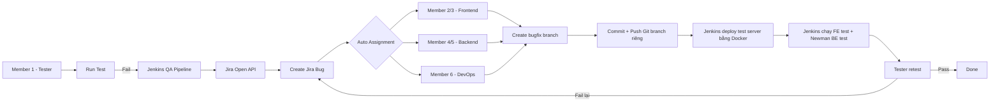

# Luồng làm việc QA - Jira - Git - Jenkins - Docker

## 1. Mục tiêu

Thiết lập luồng làm việc cho **nhóm 6 người** đúng theo hướng bạn mô tả:

- Member 1 là **Tester**.
- Tester chạy test và phát hiện bug.
- Bug được **tự động log lên Jira qua Open API**.
- Jira **tự động assign** bug cho member phù hợp để fix.
- Developer fix bug trên **một nhánh Git riêng**.
- Sau khi push branch fix, **Jenkins deploy server test bằng Docker**.
- Jenkins chạy lại test FE và BE.
- Tester retest, đạt thì đóng bug.
- Trạng thái Jira được tự động đẩy theo luồng:
  - `Bug Logged`
  - `In Progress`
  - `Ready for Retest`

## 2. Cơ cấu 6 thành viên

| Thành viên | Vai trò | Phạm vi chính |
| --- | --- | --- |
| Member 1 | Tester / QA | Viết test case, chạy test, xác nhận bug, retest |
| Member 2 | Frontend Developer A | Bug FE được chia tự động theo pool frontend |
| Member 3 | Frontend Developer B | Bug FE được chia tự động theo pool frontend |
| Member 4 | Backend Developer A | Bug BE được chia tự động theo pool backend |
| Member 5 | Backend Developer B | Bug BE được chia tự động theo pool backend |
| Member 6 | DevOps / Integrator | Docker, Jenkins, deploy server, integration, infrastructure |

File cấu hình routing:

- [team-routing.json](<D:/KCPM/BICAP-main/BICAP-main/automation/jira/team-routing.json:1>)

## 3. Luồng tổng thể giống sơ đồ



## 4. Quy tắc auto log bug và auto assignment

### 4.1 Khi nào bug được tự động log Jira

Bug được tự động tạo khi một stage QA trong Jenkins fail, ví dụ:

- `Deploy Test Stack`
- `Wait For Targets`
- `Frontend QA`
- `Backend QA`

Jenkins pipeline:

- [Jenkinsfile](<D:/KCPM/BICAP-main/BICAP-main/Jenkinsfile:1>)

Script gọi Jira Open API:

- [create-jira-bug.mjs](<D:/KCPM/BICAP-main/BICAP-main/automation/jira/create-jira-bug.mjs:1>)

### 4.2 Auto assignment cho 6 người hoạt động thế nào

- Bug loại `frontend`
  - tự động chia cho **Member 2** hoặc **Member 3**
  - chiến lược hiện tại: `round_robin`
- Bug loại `backend`
  - tự động chia cho **Member 4** hoặc **Member 5**
  - chiến lược hiện tại: `round_robin`
- Bug loại `infra` hoặc `integration`
  - tự động assign cho **Member 6**

State chia vòng được lưu runtime tại:

- `automation/jira/.assignment-state.json`

File này không cần commit lên Git, chỉ dùng để Jenkins chia người xử lý lần lượt.

### 4.3 Cần cấu hình gì để assign được thật trên Jira

Bạn phải thay các placeholder `CHANGE_ME_*_ACCOUNT_ID` trong:

- [team-routing.json](<D:/KCPM/BICAP-main/BICAP-main/automation/jira/team-routing.json:1>)

Mỗi member trên Jira Cloud phải có `accountId` thật.

### 4.4 Auto chuyển trạng thái Jira hoạt động thế nào

- Khi Jenkins tạo bug mới:
  - script Jira sẽ tự chuyển issue sang `Bug Logged`
- Khi dev push branch fix có Jira key, ví dụ `bugfix/backend/BICAP-101-fix-order-api`:
  - Jenkins tự nhận ra `BICAP-101`
  - chuyển issue sang `In Progress`
- Khi pipeline trên branch fix chạy pass:
  - Jenkins tự chuyển issue sang `Ready for Retest`
- Khi tester retest xong:
  - tester chuyển tay sang `Done` hoặc `Closed`

## 5. Luồng chi tiết theo đúng vai trò

### 5.1 Bước 1 - Tester test ra bug

Member 1 thực hiện:

1. Chọn scope cần test trên Jenkins:
   - `frontend`
   - `backend`
   - `integration`
   - `infra`
   - `all`
2. Chạy Jenkins job hoặc QA pipeline.
3. Jenkins:
   - deploy Docker test stack theo đúng scope đã chọn
   - với `frontend`: chỉ dựng subset FE cần cho smoke test giao diện
   - với `backend`: chỉ dựng subset API cần cho Newman/Postman
   - với `integration`: dựng FE + BE cần cho luồng tích hợp
   - với `infra`: dựng full stack để kiểm tra deploy, service readiness và môi trường
   - với `all`: chạy toàn bộ stack
4. Nếu test fail:
   - Jenkins tự log bug lên Jira
   - bug tự assign cho member phù hợp
   - nếu cùng một lỗi đang còn mở trên Jira, Jenkins sẽ comment vào issue cũ thay vì tạo task trùng

### 5.2 Bước 2 - Member được assign fix bug

Member nhận bug từ Jira sẽ:

1. Lấy Jira key, ví dụ `BICAP-101`.
2. Tạo branch riêng:
   - `bugfix/frontend/BICAP-101-fix-login-ui`
   - `bugfix/backend/BICAP-102-fix-order-api`
   - `bugfix/infra/BICAP-103-fix-docker-deploy`
3. Sửa bug trong branch đó.
4. Commit:
   - `git commit -m "BICAP-101 fix login ui"`
5. Push branch lên Git.

### 5.3 Bước 3 - Jenkins deploy server sau khi fix

Khi branch bugfix được push:

1. Jenkins trigger pipeline trên branch đó.
2. Jenkins tự đọc Jira key từ tên branch và chuyển issue sang `In Progress`.
3. Pipeline thực hiện:
   - build source
   - `docker compose up -d --build`
   - deploy test server
   - chạy lại FE smoke/build
   - chạy Newman cho BE
4. Nếu pass:
   - bug sẵn sàng cho retest
   - Jira tự chuyển sang `Ready for Retest`
5. Nếu fail tiếp:
   - tester thấy lỗi mới hoặc cùng lỗi
   - Jira issue cũ tiếp tục được xử lý

## 6. Thành phần đã có trong repo

### 6.1 Jenkins pipeline

- [Jenkinsfile](<D:/KCPM/BICAP-main/BICAP-main/Jenkinsfile:1>)

Pipeline hiện có các stage:

1. Checkout
2. Prepare Reports
3. Scope Summary
4. Deploy Test Stack
5. Wait For Targets
6. Infrastructure QA
7. Frontend QA
8. Backend QA

Jenkins đã hỗ trợ **Build with Parameters** với parameter:

- `QA_SCOPE = all | frontend | backend | integration | infra`

Hành vi deploy theo scope:

- `frontend`: chỉ `guest-web`, `retailer-web`, `admin-web`, `farm-management-web`, `shipping-manager-web` và dependency trực tiếp của chúng
- `backend`: chỉ `auth-service`, `admin-service`, `shipping-manager-service` và dependency trực tiếp của chúng
- `integration`: gộp subset của FE và BE
- `infra` hoặc `all`: dựng full stack

### 6.2 Jira automation

- [create-jira-bug.mjs](<D:/KCPM/BICAP-main/BICAP-main/automation/jira/create-jira-bug.mjs:1>)
- [update-jira-status.mjs](<D:/KCPM/BICAP-main/BICAP-main/automation/jira/update-jira-status.mjs:1>)
- [team-routing.json](<D:/KCPM/BICAP-main/BICAP-main/automation/jira/team-routing.json:1>)

### 6.3 FE smoke test

- [frontend-smoke.mjs](<D:/KCPM/BICAP-main/BICAP-main/qa/scripts/frontend-smoke.mjs:1>)

### 6.4 Chờ service sẵn sàng sau deploy

- [wait-for-targets.mjs](<D:/KCPM/BICAP-main/BICAP-main/qa/scripts/wait-for-targets.mjs:1>)

### 6.5 Postman/Newman smoke test cho backend

- [bicap-api-smoke.postman_collection.json](<D:/KCPM/BICAP-main/BICAP-main/qa/postman/bicap-api-smoke.postman_collection.json:1>)
- [local.postman_environment.json](<D:/KCPM/BICAP-main/BICAP-main/qa/postman/local.postman_environment.json:1>)

## 7. Quy tắc branch Git cho luồng fix bug

### 7.1 Naming branch

- FE: `bugfix/frontend/<JIRA-KEY>-<slug>`
- BE: `bugfix/backend/<JIRA-KEY>-<slug>`
- Infra: `bugfix/infra/<JIRA-KEY>-<slug>`
- Integration: `bugfix/integration/<JIRA-KEY>-<slug>`

### 7.2 Commit message

- `BICAP-101 fix guest login validation`
- `BICAP-102 fix shipment api auth`
- `BICAP-103 fix docker startup order`

### 7.3 Luồng Git bắt buộc

1. Không fix trực tiếp trên `main`.
2. Mỗi bug Jira tương ứng một branch riêng.
3. Push branch xong mới deploy test qua Jenkins.

## 8. Cấu hình Jira cần có trên Jenkins

| Biến | Ý nghĩa |
| --- | --- |
| `JIRA_BASE_URL` | URL Jira |
| `JIRA_EMAIL` | Email account gọi Jira API |
| `JIRA_API_TOKEN` | API token |
| `JIRA_PROJECT_KEY` | Key dự án Jira |
| `JIRA_ISSUE_TYPE` | Mặc định `Task` |
| `JIRA_ROUTING_FILE` | File routing member |
| `JIRA_ASSIGNMENT_STATE_FILE` | File runtime lưu vòng assign |
| `JIRA_STATUS_BUG_LOGGED` | Tên trạng thái Jira khi bug vừa được log |
| `JIRA_STATUS_IN_PROGRESS` | Tên trạng thái Jira khi dev bắt đầu fix |
| `JIRA_STATUS_READY_FOR_RETEST` | Tên trạng thái Jira khi Jenkins build pass sau fix |

Lưu ý:

- Jira Cloud dùng `accountId` để assign issue.
- Nếu chưa điền `accountId`, bug vẫn tạo được nhưng sẽ không auto assign.
- Ba trạng thái trên phải tồn tại thật trong workflow Jira của project. Nếu tên khác, đổi qua env var tương ứng.

## 9. Tester cần làm gì

Với tư cách Member 1 - Tester, bạn cần:

1. Chuẩn bị test case hoặc scenario cần test.
2. Vào Jenkins job và bấm **Build with Parameters**.
3. Chọn `QA_SCOPE` phù hợp:
   - `frontend`: chỉ test FE
   - `backend`: chỉ test BE
   - `integration`: test luồng end-to-end FE + BE
   - `infra`: test deploy và môi trường server
   - `all`: chạy toàn bộ
4. Bấm `Build`.
3. Quan sát report:
   - FE fail
   - BE fail
   - deploy fail
4. Nếu pipeline fail:
   - Jira bug sẽ được tạo tự động
   - nếu đã có issue mở cùng `module + stage`, Jenkins sẽ reuse issue đó và thêm comment mới
   - bạn chỉ cần kiểm tra bug đã đúng module, đúng mô tả, đúng người nhận
5. Sau khi dev fix xong và Jenkins deploy lại:
   - retest
   - pass thì đóng bug
   - fail thì reopen hoặc chuyển lại `In Progress`

## 10. Cách tester dùng Build with Parameters

1. Mở Jenkins job QA của dự án.
2. Bấm `Build with Parameters`.
3. Ở trường `QA_SCOPE`, chọn một trong các giá trị:
   - `frontend`
   - `backend`
   - `integration`
   - `infra`
   - `all`
4. Bấm `Build`.
5. Theo dõi `Console Output`.
6. Nếu build fail:
   - vào Jira xem issue mới
   - xác nhận issue được assign đúng member
   - xác nhận status đã là `Bug Logged`
7. Nếu build pass:
   - tiếp tục test tay hoặc chờ dev merge/fix tiếp

## 11. Nếu tester phát hiện bug thủ công

Nếu bug chưa có test tự động nhưng tester phát hiện được bằng tay, có thể tự log qua script:

```bash
node automation/jira/create-jira-bug.mjs \
  --module frontend \
  --stage "Manual QA" \
  --descriptionFile qa/reports/frontend-failure.txt
```

Hoặc đổi `frontend` thành `backend`, `infra`, `integration`.

Bạn cũng có thể đổi trạng thái thủ công bằng script nếu cần:

```bash
node automation/jira/update-jira-status.mjs \
  --issueKey BICAP-101 \
  --status "Ready for Retest"
```

## 12. Điều kiện tiên quyết

- Jenkins agent có Docker.
- Jenkins agent có Node.js 18+.
- Jira credentials đã cấu hình.
- Account ID Jira của 6 member đã được khai báo trong routing file.

Ghi chú cho Windows agent:

- Jenkinsfile hiện dùng `npm.cmd` và `npx.cmd` để tránh lỗi PowerShell execution policy.

## 13. Kết luận

Sau khi mình chỉnh xong, workflow bây giờ phù hợp với mô hình **6 người**:

- Tester test ra bug.
- Bug tự log Jira.
- Jira tự assign cho đúng member FE/BE/DevOps.
- Dev fix trên branch Git riêng.
- Push branch xong Jenkins tự deploy server test lại bằng Docker.
- Tester retest và đóng bug.

Đây chính là luồng gần sát với sơ đồ bạn gửi lên bảng.
